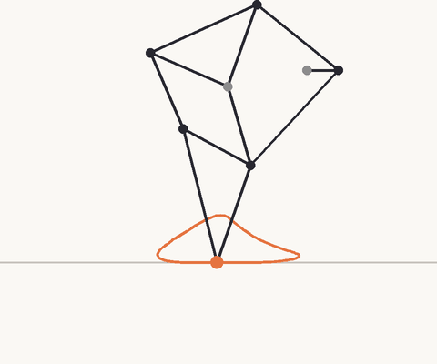
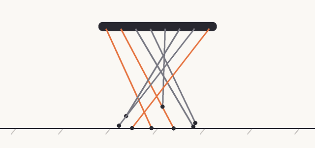

# strandbeest-evolution

Research project on the leg linkage of Theo Jansen's Strandbeest: kinematics, evolutionary optimization, quasi-static wind-driven dynamics, an interactive demo, and companion articles. ([中文 README](README.md))




Platform design and phase plan: [docs/PLATFORM.md](docs/PLATFORM.md) (Chinese).

## What's inside

| Path | Contents |
|---|---|
| `packages/core` | Pure TypeScript library (npm: `strandbeest-core`): linkage solver, gait metrics, seeded GA, multi-leg, quasi-static dynamics and sail model |
| `packages/sim` | Python / MuJoCo dynamics simulator, scenario-file driven (see [design](docs/SIM-DESIGN.md)); early, torque results not yet converged |
| `hardware/` + `packages/rig` | Test rig: design and calibration procedures, ESP32 firmware, raw-data-to-Measurement conversion with quality checks, ArUco video tracking; **not yet run on real hardware**, see [hardware/README.md](hardware/README.md) |
| `apps/web-demo` | Interactive demo: drag the 13 lengths and watch the foot path; run the GA in the browser; wind estimate panel |
| `scripts/` | Experiment scripts (evolution, re-discovering Jansen, dynamics comparison) and GIF rendering |
| `docs/` | Roadmap, architecture, research notes (sources), experiment log |

## Run

Full chain (Python side):

```bash
./scripts/setup-python.sh && source .venv/bin/activate
strandbeest-pipeline run schemas/examples/design-jansen-small-6leg.json out/   # evaluate → print pack → simulate
strandbeest-api                                                                 # backend for the web demo below
docker compose up --build                                                       # or the whole local lab at once (web 8080, API 8000); see docs/DEPLOY.md
```


```bash
pnpm install
pnpm check
pnpm --filter @strandbeest/web-demo dev
pnpm experiment flat 1 80
pnpm dynamics
```

## Honest caveats

- Sources for Jansen's 13 lengths and the linkage topology are in [research notes](docs/RESEARCH-NOTES.md); the evolution timeline was checked against strandbeest.com's period pages (except Pregluton).
- The dynamics is **quasi-static** (no inertia, no slip, no soft ground); sail, gearing and resistance are illustrative assumptions. Use it to compare designs, not to predict real walkers.
- Our GA is a reconstruction of the *idea* of evolving leg lengths, not Jansen's actual method.

Issues and PRs welcome. MIT licensed.
